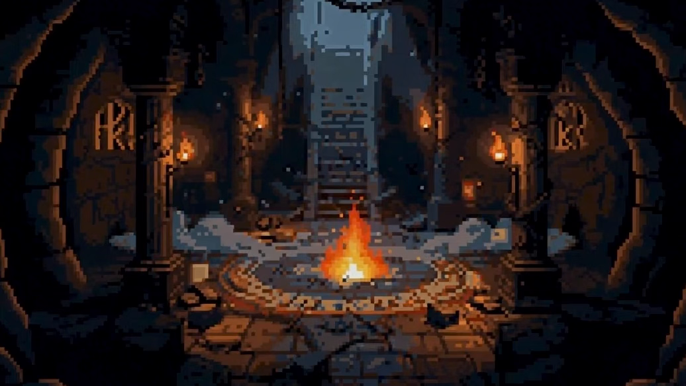
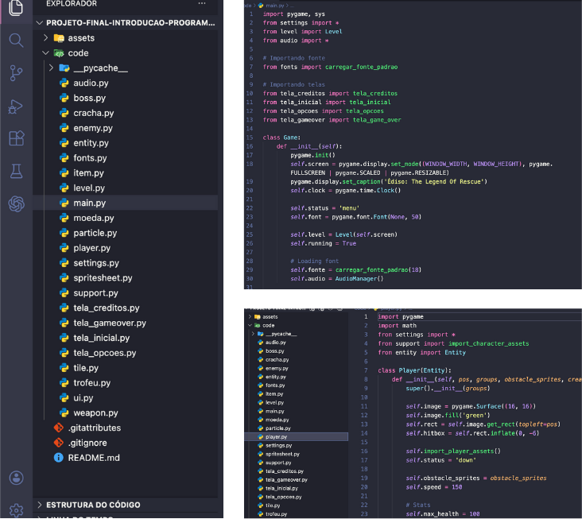
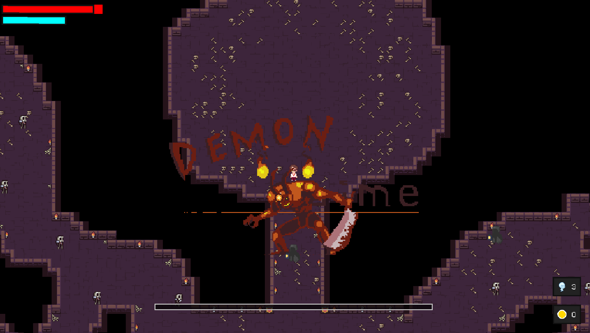

## Édiso: The legend of the rescue

> Olá, seja bem-vindo(a) ao repositório do jogo entitulado: "Édiso: The legend of the rescue". Ele faz parte de um conjunto de entrega para o projeto final da disciplina Introdução à Programação do CIn - Centro de Informática da UFPE - na turma de Sistemas de Informação 2025.2.

> ### Membros da Equipe e Divisão de Trabalho:
>- Ana Clara: Criação dos sprites de Édiso, das suas animações de ataque e produção dos slides.
>
>- Bernardo Belfort: Sistema de coletáveis, telas e lógica da lojinha.
>
>- Edísio Uchôa: Sistema do player, inimigos e boss.
>
>- Francisco Faustino: Criação de sprites, produção dos slides e do relatório.
>
>- Gabriel Cássio: Gerência do projeto, integração e arquitetura do código.
>
>- Victor Lemos: Mapa, integração e arquitetura do código.

> ### Monitores Responsáveis:
>- Ian Cerqueira
>- Thiago Alves

> ### Principais Ferramentas e Bibliotecas:
> #### Git + GitHub
>Versionamento do código, criação de branches, revisão via Pull Requests e organização do trabalho em equipe.
> #### Visual Studio Code
> Ambiente principal de desenvolvimento, depuração e organização do projeto em módulos.
> #### Python
> Linguagem usada para estruturar toda a lógica do jogo, entidades, estados e o loop principal.
> #### Pygame (Community Edition) 
> Motor do jogo: ciclo de vida da aplicação, renderização, sprites/animções, controle de FPS e captura de inputs.
> #### Aseprite 
> Criação e exportação de pixel art, spritesheets e frames de animação.
> #### Itch.io 
> Plataforma planejada para desenvolvedores de jogos independentes, na qual foram pegos assets de sprites públicos e que também está prevista para a publicação/distribuição do build e divulgação do projeto.
> #### pygame.math
> Vetores e cálculos auxiliares (direção, distância, normalização), usados em movimentação e IA.
> #### heapq 
> Fila de prioridade para otimizar o pathfinding (A*), reduzindo custo de processamento nas rotas dos inimigos.
> #### csv
> Leitura dos mapas/níveis exportados em matriz e conversão para tiles/obstáculos no cenário.
> #### os
> Varredura de diretórios para carregar automaticamente assets (spritesheets/animações) e organizar caminhos.
> #### random
> Variação controlada no comportamento dos inimigos (timers e decisões), evitando padrões repetitivos e picos de cálculo.
> #### sys
> Encerramento seguro do jogo e integração básica com o interpretador ao sair.

> ### Arquitetura | Estrutura do Projeto:
>
>
>
>A arquitetura do projeto se baseia em 2 main folders, um que contém todos os assets utilizados no jogo, o outro contém todo o código fonte. Além desses main folders utilizamos um .gitignore para arquivos residuais que aparecem quando executado na plataforma do Pycharm, e um README.md com o conteúdo deste relatório.
>
>Dentro do Main Code folder encontramos além do arquivo main.py (principal para execução do jogo) as demais entidades e métodos para o correto funcionamento do jogo, desde os coletáveis até o sistema de luta contra os inimigos e o chefe final. 

> ### Desafios e erros enfrentados
> 
> #### Desafios:
>- Falta de conhecimento prévio sobre Git e GitHub.
>- Organização de tempo de trabalho e estudo.
>- Integração de códigos complexos em uma única instância (main.py).
>- Entendimento de arquitetura de projetos mais profissionais e design patterns para jogos.
>
> ### Erros:
>- Tardia alteração da arquitetura de projeto para facilitar o entendimento e consequente desenvolvimento do jogo.

> ### Conceitos Aplicados
>-  **Variáveis**: Utilização para armazenar estado de um sistema dinâmico ou estático, a exemplo, temos o de velocidade que utilizou para armazenar a variação das coordenadas da posição das entidades em jogo.
>- **Condicionais**: Aplicado em todo o escopo como mediadores de progresso e estado das entidades e sistemas.
>- **Iteração**: Utilizada desde o loop de execução principal da main do jogo, temos sua aplicação em diferentes sistemas com multi-elementos em que queremos maior controle, a exemplo, no momento de desenhar as diferentes superfícies dos coletáveis que colocamos em um folder que queremos iterar.
>- **Dicionário, tuplas e listas**: Utilizada para armazenar e coordenar as informações entre os sistemas.
>- **Funções e Classes**: Estruturas utilizadas para grande parte das ações e instanciamento de grupos lógicos dos sistemas